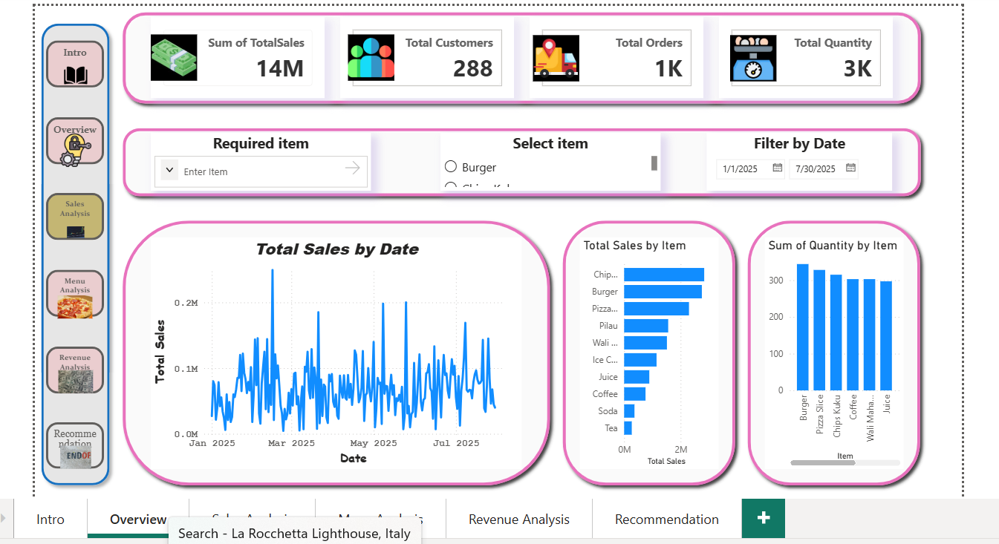
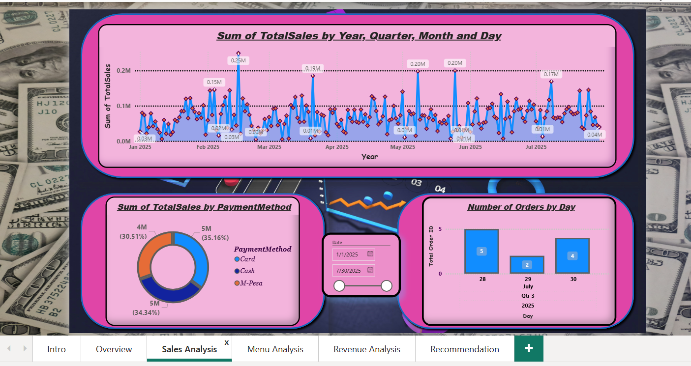
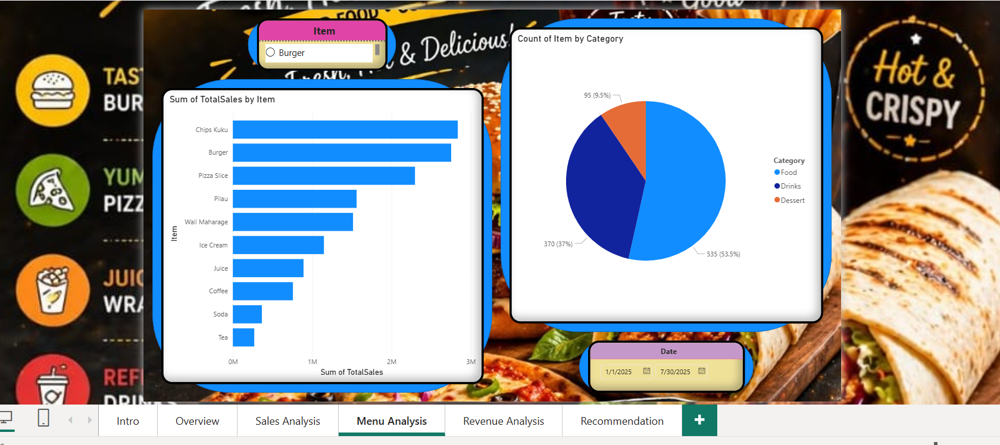
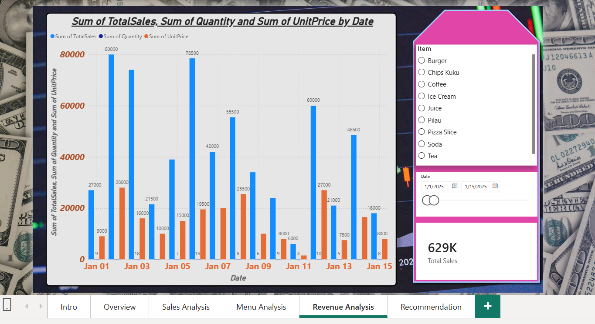

                                 1: TITLE OF THE PROJECT:
Sales Dashboard for Restaurant X

                                 2: PROJECT OVERVIEW:
This Project aimed at presents valuable insights from restaurant X data from 1st January 2025 to 30th July 2025 by visualizing sales trends and menu analysis so as to identify top performing items, Orders by each day, top payment methods used for business improvements.

                                 3: BUSINESS OBJECTIVES:
-->  To track sales trends over time from 1st January 2025 to 30th July 2025.

-->  To identify top items with most revenues and items with higher Quantity sold.

-->  To track items with least revenues per date range.

-->  To evaluate payment methods usage.

-->  To support data-driven decision making.

                                4: DASHBOARD FEATURES:
-->  Overview.

-->  KPI Cards.

-->  Interactive Filters (Slicers).

-->  Sales Analysis.

-->  Menu Analysis.

-->  Revenue Analysis.

-->  Key Insights & Recommendations.

                                5: SCREENSHOTS:

        ** OVERVIEW.

        ** SALES ANALYSIS.

        ** MENU ANALYSIS.

        ** REVENUE ANALYSIS.

                                  6: TOOLS & TECHNOLOGIES USED:
-->  Power BI Desktop.

-->  DAX.

-->  GitHub.

                                  7: KEY INSIGHTS:
(i) Chips Kuku is the top item with highest revenue in
which total sales is 2,835,000 in all months.

(ii) Tea is the least revenue item with total sales of 270,000 in all months.

(iii) Burger is the Top sold item based on Quantity, 344 Burgers were sold in all months.

(iv) Juice is the least sold item based on Quantity, 297 juices were sold in all months.

(v) The most used payment method is CARD method in which 35.16% of all payments in all months were performed via card.

(vi) A day with many orders was 3rd july 2025, we got 5 orders.

(vii) Day with highest sales was friday of 24 january 2025 with total of 122,000.

                                    8: RECOMMENDATIONS:
(A) Increase marketing efforts for Burger and Chips Kuku so as to maximize revenue.

(B) Improve pricing, Quality and promotional strategies for low performing items including Tea and juice.

(C) Use monthly sales trends to improve inventory and staffing planning.